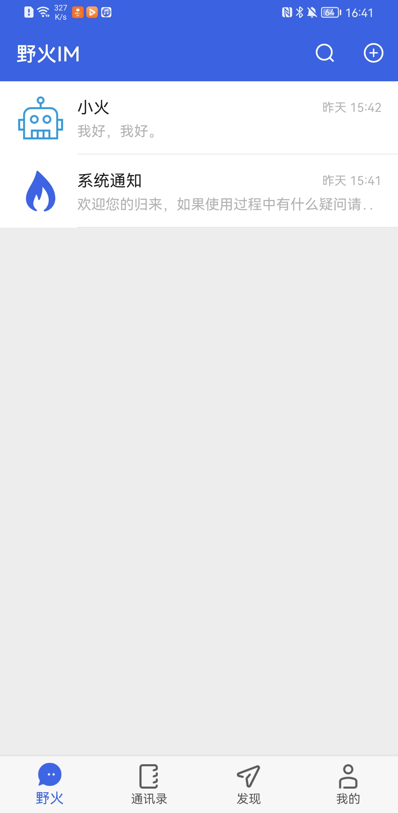

野火IM 服务端Python SDK
----

野火IM是一套开源通用的即时通讯组件，能够更加容易地赋予客户IM能力，使客户可以快速的在自有产品上添加聊天功能。使用野火可以替代云通讯产品或减少自研IM的工作量。降低客户使用IM的成本和难度。  

最开始做findu app（http://findu.co）的时候就调研过各种im通讯方案，最终选择了阿里的open im，其实最主要的原因有两个：1. 完全免费，2. 不限制用户数量。  
当然最终还是应了那句老话，免费的才是最贵的~~。  
虽然现在还能登录百川的开发者后台，但是页面已经挂了非常多了，没有办法更新push整数，也没办法继续添加好友了：  
  
百川的官方https://baichuan.taobao.com/product/im.htm?spm=a3c0d.7662652.1998907869.5.1cacbe48MUROig 还能继续访问，但是，所有的文档都已经停留在了18年：https://baichuan.taobao.com/doc2/detail.htm?spm=a3c0d.8121624.0.0.2442be48xtvo1v&treeId=41&articleId=102626&docType=1  
本着免费，不受限制的原则，最近又看了下各种im框架，基本没有什么比较好的选择了，直到发现了野火im，这真的不是野火的广告。  
由于原有的后端服务是基于django实现的，所以为了能够正常使用原有的业务系统，需要进行后端整合，而野火的服务端sdk只有java的，好在同时提供了rest api，于是我花了点时间用python封装了一下，目前支持用户管理，好友管理，消息发送，其他的内容尚未整合。具体代码可以参考sdk。  

后一步就是重新进行findu的重构了，包含：
1. 服务端代码整合，替换im框架 
2. 安卓版本的重新开发
3. iOS版本的重新开发  

如果你对于实现这么一个app感兴趣，欢迎联系我，一块进行开发实现（不管是后端还是前端）。需要说明的是，该项目为免费app，不会产生收益，也不会付费下载，所以嗯，要想加入的智能靠爱发电~~~  

野火IM相关资源链接：  
https://bbs.wildfirechat.cn/  
https://gitee.com/wfchat  
https://wildfirechat.cn/  

> ###obaby@mars  
> by:obaby  
> http://www.h4ck.org.cn  
> http://www.obaby.org.cn  
> http://www.findu.co  